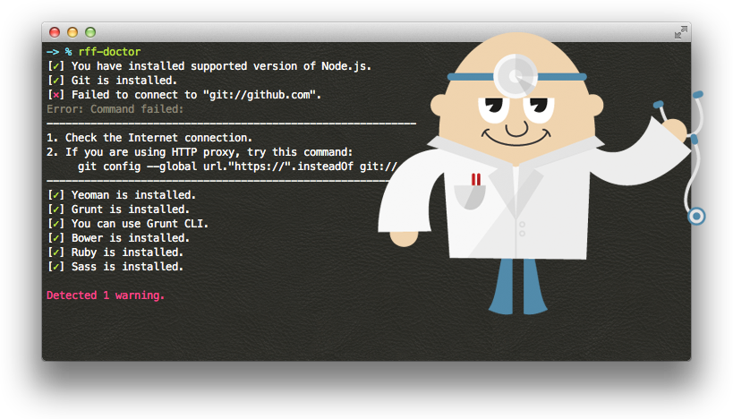

# rff-doctor

> Verify system configuration for using Yeoman, Grunt and Bower

[![NPM Version][npm-image]][npm-url]
[![Build Status][travis-image]][travis-url]
[![Dependency Status][deps-image]][deps-url]



Illustration: <a href="http://www.freepik.com/free-photos-vectors/vintage" target="_blank">Vintage vector designed by Freepik</a>

## Installation
```shell
$ npm install -g rff-doctor
```

## Usage
```shell
$ rff-doctor
```

## Options
* `-h`, `--help`  
  Display command usage and exit.

* `-v`, `--version`  
  Display version and exit.

## API
```javascript
var doctor = require('rff-doctor');
doctor.run(function (error, results) {
  // error:
  //   Execution error. This is different from the warning of doctor.
  //
  // results:
  //   Array of objects.
  //   [{
  //     name:         Name of test
  //     status:       'ok', 'ng' or 'skipped'
  //     description:  Result message
  //     hint:         Hint message
  //     error:        Error object or null
  //   }, ... ]
});
```

## License
Copyright (c) 2014-2015 Rakuten, Inc. Licensed under the [MIT License](LICENSE).

[npm-image]: https://img.shields.io/npm/v/rff-doctor.svg
[npm-url]: https://www.npmjs.org/package/rff-doctor
[travis-image]: https://img.shields.io/travis/rakuten-frontend/rff-doctor/master.svg
[travis-url]: https://travis-ci.org/rakuten-frontend/rff-doctor
[deps-image]: http://img.shields.io/david/rakuten-frontend/rff-doctor.svg
[deps-url]: https://david-dm.org/rakuten-frontend/rff-doctor
